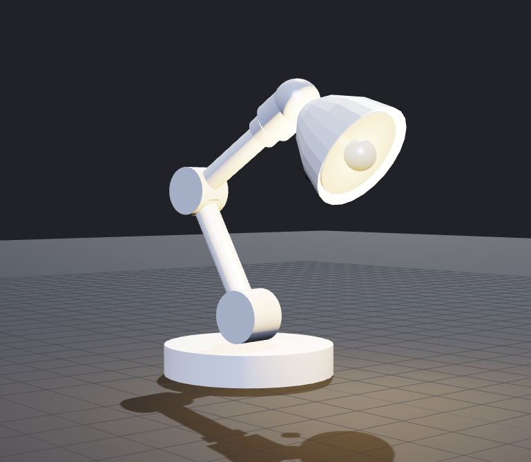
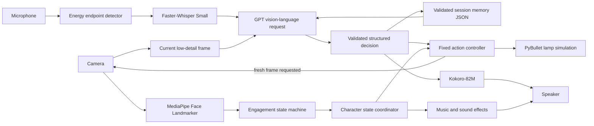

# Lux: Live Lamp Character



Lux is a live, expressive lamp character built for the Software/CV Character
Robot Challenge. It combines a simulated five-joint body, webcam perception,
speech, vision-language reasoning, short-term scene memory, expressive light,
sound effects, and music in one continuous desktop interaction.

The application is designed for a CPU-only Ubuntu 24.04 laptop, but it also
runs on Windows. The laptop camera, microphone, and speaker act as the robot's
sensors and voice; PyBullet renders the supplied URDF as its body.

## What Lux can do

- Render and animate the supplied five-DOF lamp in a PySide6 desktop window.
- Detect when a person looks toward the camera by combining head direction,
  iris position, eye openness, and apparent face size.
- Greet an engaged person and disengage only after attention has been away for
  three continuous seconds.
- Listen through the microphone and detect the end of an utterance after two
  continuous seconds of silence.
- Transcribe speech locally with Faster-Whisper and Whisper Small.
- Send the transcript, current camera image, and validated session memory to a
  GPT vision-language model for a context-aware response.
- Speak replies locally with Kokoro-82M using the `af_heart` voice.
- Remember user-relevant visual facts, such as an object's color and location,
  and answer questions about them later in the same run.
- Choose safe, fixed lamp actions such as looking left, looking right, nodding,
  or shaking its head.
- Move, capture a fresh image, and ask the model to reason again when one view
  is insufficient for a scene-based goal.
- Coordinate motion, colored light, voice, procedural sound effects, and a
  quiet character theme without microphone self-triggering.
- Show per-turn STT, GPT, and TTS timing in the interface.

## Example interaction

1. The user looks toward the camera. Lux enters **Engage**, plays its greeting,
   and waits until the local speech models are ready.
2. The user says: “Look toward the green cup on the left side of your camera
   view. If you can see it, nod, and remember its color and location.”
3. Whisper transcribes the request locally.
4. GPT receives the transcript, memory JSON, and current camera frame. It can
   select `inspect_left` and request another observation.
5. Lux turns left, captures a newer frame, and sends the updated observation
   with the decision history to GPT.
6. GPT either selects another single action and asks for one more observation,
   or finishes with `nod_yes`/`shake_no`, a spoken answer, and updated memory.
7. A later question can be answered from the stored scene summary.

See [DEMO.mp4](DEMO.mp4) for the recorded demonstration.

## Installation

Use the platform-specific guide:

- [Windows installation guide](docs/INSTALL_WINDOWS.md)
- [Ubuntu 24.04 installation guide](docs/INSTALL_UBUNTU.md)

The short version is one command from the project directory.

Windows PowerShell:

```powershell
powershell -ExecutionPolicy Bypass -File .\setup.ps1
```

Ubuntu 24.04:

```bash
bash setup.sh
```

Both setup programs create an isolated Python 3.11 environment, install all
Python dependencies, download and warm the local speech models, run the unit
tests, and run the PyBullet smoke test. Ubuntu setup also installs the required
Qt/XCB, OpenGL, PortAudio, and eSpeak system libraries.

## Running the application

Lux requires `OPENAI_API_KEY` for GPT language and vision requests. Local speech
recognition and local speech synthesis do not use that key.

Windows PowerShell:

```powershell
$lampKey = Read-Host "OpenAI API key" -AsSecureString
$env:OPENAI_API_KEY = [Net.NetworkCredential]::new("", $lampKey).Password
.\.conda-env\python.exe run.py
```

Ubuntu:

```bash
read -rsp "OpenAI API key: " OPENAI_API_KEY && echo
export OPENAI_API_KEY
./.conda-env/bin/python run.py
```

The key is held only in the current terminal's environment. The setup scripts
do not request, save, print, or modify it.

## Architecture



The system deliberately separates model decisions from body execution. GPT can
select a high-level action label, but application-owned code validates that
label and executes fixed keyframes. The model never writes joint commands.

## End-to-end data flow

### 1. Engagement

The camera worker opens a 640×480 stream and runs the checked-in MediaPipe Face
Landmarker model locally. It derives a frame-level observation from:

- head yaw, with a default limit of ±23 degrees;
- head pitch, with a default limit of ±18 degrees;
- average horizontal iris offset, limited to ±0.20 of normalized eye width;
- normalized eye openness, which must be at least 0.10;
- normalized face area, which must be at least 0.018.

A temporal state machine requires 0.7 seconds of continuous attention to enter
engagement and 3.0 seconds continuously away to leave it. Engagement changes
are deferred while Lux is thinking or speaking, so a running conversational
turn is not interrupted by a noisy camera transition.

These thresholds are practical interaction heuristics, not a psychological or
medical attention measurement. Lighting, glasses, face geometry, and camera
placement can affect the result.

### 2. Character state and audiovisual behavior

The main coordinator maps interaction stages to character behavior:

| Stage | Body and light | Audio behavior |
|---|---|---|
| Idle | Slow resting motion, dim warm light | Character audio ready; music stopped |
| Engage/Greet | Rise, turn, glance, and nod with warm light | Greeting cue and theme |
| Listen | Lean toward the user, blue light, subtle sway | Music/effects suspended |
| Think | Curious side look, violet light | Microphone and effects suspended |
| Answer | Face the user, green light, speech gesture | Kokoro speech, then optional success cue |
| Disengage | Look away and return to rest | Disengagement cue |

Greeting lasts until both its motion and sound cue are complete. Listening has
no sound effect. The microphone remains closed throughout GPT processing and
the entire TTS playback, then reopens 0.9 seconds after the voice worker exits.

Music and procedural effects run in a dedicated audio thread. Audio failures
are reported in the interface but do not stop simulation, camera, speech, or
language features.

### 3. Local speech recognition

Each listening cycle first measures ambient sound for 0.6 seconds. An adaptive
energy detector then waits for speech and tracks trailing silence. After speech
begins, two continuous seconds of silence submit the utterance; renewed speech
resets the silence window.

Audio remains an in-memory mono PCM WAV. Faster-Whisper transcribes it with:

- model: multilingual Whisper Small;
- device: CPU;
- compute type: `int8`;
- beam size: 5;
- VAD filtering enabled;
- previous-text conditioning disabled.

The model is cached under `models/faster-whisper/` and reused in memory. Empty
or noise-only transcription is treated as a normal no-speech event and quietly
retries while engagement remains active.

### 4. GPT language, vision, and action protocol

The default language model is `gpt-5.6-luna`, called through the OpenAI
Responses API with structured Pydantic output, `reasoning.effort="none"`, and
`store=False`.

Every initial model request contains:

- the recognized user utterance;
- the complete current session-memory document;
- one resized current camera frame with low image detail;
- a unique observation ID and capture timestamp.

The model must return a schema-validated object containing:

```text
reply
motion_labels              # zero or one whitelisted label
request_another_observation # boolean
updated_memory
```

Allowed model-selectable actions are:

- `inspect_left`
- `inspect_right`
- `nod_yes`
- `shake_no`

Only one action is accepted per response. If more actions are necessary, GPT
returns one action and sets `request_another_observation=true`. Lux executes the
action, waits for a newer camera frame, and makes a follow-up request containing
the original utterance, current memory, new frame, and prior decision history.

A single user turn is limited to three visual observations. The last response
must finish the turn rather than request another image. Planning replies are not
spoken or written to memory; only the final validated response is committed.

If the API key, camera image, network request, or schema validation fails, Lux
preserves the previous memory and uses the safe fallback response “I get it.”

### 5. Session and scene memory

Memory is stored in `data/session_memory.json` by default:

```json
{
  "version": 1,
  "session_id": "session-...",
  "conversation_summary": "No conversation yet.",
  "scene_memories": [],
  "turn_count": 0,
  "updated_at": "2026-09-20T00:00:00+00:00"
}
```

The model updates the conversation summary on each completed turn. It may add
compact scene observations only when the user's request creates a reason to
observe, identify, remember, compare, or recall something. Application-side
normalization prevents unrelated observation IDs and ungrounded metadata from
being committed. The file is written to a temporary document, flushed, and
atomically replaced only after validation.

Each normal GUI launch resets the selected memory file, so memory lasts for the
current application session rather than across restarts. Raw images and audio
are never written to the memory file.

### 6. Local speech synthesis

Final reply text is synthesized locally with:

- model: `hexgrad/Kokoro-82M`;
- default voice: `af_heart`;
- language code: American English (`a`);
- device: CPU;
- output: in-memory mono float32 audio at 24 kHz.

The cache is stored under `models/huggingface/`. Setup downloads the model and
runs a silent warm-up phrase so that the first real answer does not pay the full
model and voice initialization cost. If Kokoro fails, `pyttsx3` provides an
operating-system voice fallback.

### 7. Motion, light, and simulation

PyBullet loads `robot/dummy_lamp_5dof.urdf` with a fixed base and position
control. CPU TinyRenderer produces the 320×256 live preview; automated
screenshots use an 800×640 render. CUDA and a discrete GPU are not required.

The five controlled joints and hard limits are:

| Joint | Minimum | Maximum |
|---|---:|---:|
| `base_yaw_joint` | -2.600 rad | 2.600 rad |
| `shoulder_pitch_joint` | -0.750 rad | 1.050 rad |
| `elbow_pitch_joint` | -1.850 rad | 0.400 rad |
| `neck_yaw_joint` | -1.350 rad | 1.350 rad |
| `head_pitch_joint` | -0.900 rad | 0.700 rad |

Eleven application-owned behaviors cover idle, engagement, greeting, listening,
thinking, answering, disengagement, left/right inspection, nodding, and head
shaking. Every keyframe commands exactly the five movable joints and is checked
against the URDF hard limits at import time. Semantic light colors are animated
with the motion.

### 8. Concurrency and ownership

Long-running I/O and inference use Qt workers so the render and control window
remain responsive:

- camera capture and MediaPipe inference;
- microphone capture and Whisper transcription;
- initial GPT request;
- follow-up GPT observation request;
- local TTS generation and playback;
- character music and sound effects;
- startup model loading and warm-up.

The GUI thread owns the conversation state machine, schedules actions, locks
engagement transitions during a turn, and commits final memory updates.

## Data handling and cost

| Data | Local processing | Sent to OpenAI | Saved by this app |
|---|---|---|---|
| Microphone audio | Endpoint detection and Whisper STT | No | No |
| Transcript | Conversation orchestration | Yes | Summarized in session memory |
| Camera frame | MediaPipe engagement | Yes, one or more frames per GPT turn | No |
| Memory JSON | Validation and atomic storage | Yes, with each GPT request | Yes, current session only |
| Reply text | Kokoro TTS | Generated by GPT | Included in conversation summary |
| Synthesized speech | Kokoro playback | No separate TTS service | No |

Whisper and Kokoro have no per-call API fee after downloading. GPT requests are
billable and require internet access. `store=False` is set on each Responses API
request, but OpenAI's applicable service and retention policies still govern
data sent to the API.

## Command-line options

| Option | Purpose |
|---|---|
| `--camera-index INDEX` | Select another camera device. |
| `--audio-device INDEX` | Select a microphone input device. |
| `--audio-output-device INDEX` | Select the effects/music output device. |
| `--no-camera` | Disable the camera and engagement worker. GPT turns fall back because every request requires an image. |
| `--no-speech` | Disable microphone interaction. |
| `--no-character-audio` | Disable music and sound effects. |
| `--no-llm` | Use the fixed local fallback instead of GPT. |
| `--local-voice` | Use the operating-system TTS voice instead of Kokoro. |
| `--transcription-model MODEL` | Change the Faster-Whisper model or use a local model path. |
| `--llm-model MODEL` | Override the GPT model ID. |
| `--tts-model MODEL` | Override the Kokoro repository ID. |
| `--tts-voice VOICE` | Change the Kokoro voice. |
| `--memory-file PATH` | Use another session-memory JSON file. |
| `--urdf PATH` | Load another compatible URDF. |
| `--model PATH` | Use another MediaPipe Face Landmarker task file. |
| `--smoke-test` | Validate PyBullet, the URDF, all actions, and a rendered frame. |
| `--camera-smoke-test` | Exercise the real camera and local face inference for three seconds. |
| `--speech-smoke-test` | Exercise microphone capture without uploading audio. |
| `--screenshot PATH` | Render the GUI to a PNG and exit. |

Examples are available in the platform installation guides.

## Repository layout

```text
.
├── run.py                         Application entry point
├── setup.ps1                      One-command Windows setup
├── setup.sh                       One-command Ubuntu setup
├── environment.yml                Cross-platform Python 3.11 environment
├── requirements.txt               Pip dependency reference
├── docs/
│   ├── INSTALL_WINDOWS.md
│   └── INSTALL_UBUNTU.md
├── robot/                         Supplied URDF, reference image, and STL
├── models/                        Face model and generated local model caches
├── data/session_memory.json       Current-run validated memory
├── scripts/preload_models.py      Whisper/Kokoro download and warm-up
├── src/lamp_character/
│   ├── actions.py                 Fixed motions, lights, and safety validation
│   ├── app.py                     GUI and interaction coordinator
│   ├── audio.py                   Procedural cues and music
│   ├── camera.py                  Camera capture and MediaPipe worker
│   ├── engagement.py              Face cues and temporal state machine
│   ├── language.py                GPT structured protocol and workers
│   ├── memory.py                  Schemas, normalization, and atomic storage
│   ├── model_adapter.py           URDF/mesh adaptation support
│   ├── simulator.py               PyBullet control and rendering
│   └── speech.py                  Endpoint detection, Whisper, Kokoro, playback
└── tests/                          Unit and contract tests
```

## Verification

The automated suite covers action limits, audio contracts, engagement timing,
structured language replies, iterative visual observations, memory integrity,
speech endpoint detection, local TTS behavior, turn timing, and the supplied
URDF/mesh contract.

Windows:

```powershell
.\.conda-env\python.exe -m unittest discover -s tests -v
.\.conda-env\python.exe run.py --smoke-test
.\.conda-env\python.exe run.py --camera-smoke-test
.\.conda-env\python.exe run.py --speech-smoke-test
$env:QT_QPA_PLATFORM = "offscreen"
.\.conda-env\python.exe run.py --screenshot output\motion-studio.png
```

Ubuntu:

```bash
./.conda-env/bin/python -m unittest discover -s tests -v
./.conda-env/bin/python run.py --smoke-test
./.conda-env/bin/python run.py --camera-smoke-test
./.conda-env/bin/python run.py --speech-smoke-test
QT_QPA_PLATFORM=offscreen ./.conda-env/bin/python run.py --screenshot output/motion-studio.png
```

The unit suite and Windows PyBullet render smoke test have been run successfully.
The Ubuntu setup script and required Ubuntu 24.04 package names have been
checked, but camera, microphone, speaker, and visible-GUI operation must still
be validated on a physical Ubuntu 24.04 laptop.

## Challenge coverage

| Challenge requirement | Implementation |
|---|---|
| Engagement | Local MediaPipe face/iris cues with asymmetric temporal filtering |
| Character response | Coordinated motion, semantic light, voice, SFX, and music |
| Spoken interaction | Local Whisper STT, GPT reply, local Kokoro TTS |
| Scene memory | Validated conversation summary and observation-bound scene entries |
| Goal-directed action | GPT-selected fixed motion followed by fresh visual observation |
| CPU-only deployment | PyBullet TinyRenderer, CPU Whisper `int8`, CPU Kokoro |

## Design tradeoffs and limitations

- GPT vision-language reasoning provides flexible scene understanding quickly,
  but it requires Wi-Fi, an API key, and billable requests.
- Fixed high-level motions create a clear safety boundary and are easy to
  explain, but they are less flexible than continuous VLA joint control.
- Engagement uses one face and heuristic thresholds; it is lightweight but not
  robust to every person, camera angle, or lighting condition.
- Session memory is intentionally reset on each GUI launch. Cross-session user
  profiles and long-term memory are outside the current scope.
- A turn can inspect at most three camera views and execute one action between
  model calls, preventing unbounded API loops at the cost of complex plans.
- The simulated base is fixed. No real robot communication, collision-aware
  trajectory planning, torque control, calibration, or emergency-stop protocol
  is implemented.
- First installation requires substantial downloads and several gigabytes of
  free space for the environment and local model caches.
- Windows has been exercised end to end. Full Ubuntu hardware validation remains
  an explicit deployment step.

## Source challenge documents

- [CHALLENGE.md](CHALLENGE.md)
- [SUBMISSION.md](SUBMISSION.md)
- [VARIANT.md](VARIANT.md)
